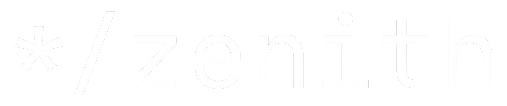

<div align="center">
  <a href="https://github.com/AmanTShekar/Zenith-CMS">
    
  </a>
  <br />
  <br />

  <p align="center">
    <a href="https://github.com/AmanTShekar/Zenith-CMS/actions"></a>
    &nbsp;
    <a href="https://www.npmjs.com/package/@zenith/core"></a>
    &nbsp;
    <a href="https://www.npmjs.com/package/@zenith/core"></a>
    &nbsp;
    <a href="https://discord.gg/zenith"></a>
    &nbsp;
    <a href="https://github.com/AmanTShekar/Zenith-CMS/blob/main/LICENSE"></a>
  </p>

  <h3>
    <a href="./docs/README.md">Documentation</a>&nbsp;·&nbsp;<a href="./docs/EXAMPLES.md">Blueprints</a>&nbsp;·&nbsp;<a href="https://community.zenithcms.com">Community</a>&nbsp;·&nbsp;<a href="https://roadmap.zenithcms.com">Roadmap</a>
  </h3>
</div>

<hr />

> [!IMPORTANT]
> **Zenith is the first-ever "Industrial Operational Platform" built for the next generation of digital engineering.** It is not just a CMS; it is a high-fidelity engine for orchestrating entire digital ecosystems.

---

## What is Zenith?

Zenith is a **Visual-First, Pro-Code Operational Platform.**

It was engineered for organizations that demand surgical precision, hyper-performance, and absolute architectural control. Zenith bridges the gap between complex backend engineering and high-velocity visual orchestration. It is the **Central Processing Nucleus** for your digital identity.

### Industrial Advantages
*   **Hybrid Data Engine**: Seamlessly switch between MongoDB (Elastic) and PostgreSQL (Relational) via the Unified Adapter Layer.
*   **Zod AOT Validation**: Schema enforcement is compiled ahead-of-time for maximum server-side efficiency.
*   **Spatial Content Mapping**: Orchestrate complex content relationships on a limitless 2D canvas, built for high-density information architecture.
*   **Neural Bridge**: A state-of-the-art webhook engine with built-in HMAC signing, exponential backoff, and delivery auditing.
*   **Pro-Code Extensibility**: Every aspect of the nucleus—from the API layer to the Admin dashboard—is 100% extensible via the Plugin Nucleus.

---

---

## Project Status and Operational Roadmap

Zenith is currently in **Active Development (Phase 2: Architectural Hardening)**.

### Current Capabilities (Stable)
*   **Industrial Core**: Type-safe Express kernel with zero-trust ingress.
*   **Neural Bridge**: Advanced webhook engine with HMAC security.
*   **Elastic Storage**: Native MongoDB adapter with high-throughput synchronization.
*   **Media Nucleus**: Local and Cloud-based media orchestration.
*   **Hardened Auth**: RBAC and JWT-based session management.

### Coming Soon (Q3 2026)
*   **SQL Catalyst**: Native PostgreSQL support via Drizzle ORM (Beta).
*   **Spatial Editor v2**: Enhanced 2D canvas for complex relationship mapping.
*   **Plugin Nucleus**: Official marketplace for community extensions.
*   **AOT Compiler**: Full Ahead-of-Time compilation for Zod schemas.
*   **Edge SDK**: Optimized client for Cloudflare Workers and Vercel Edge.

---

## Quickstart

Before starting with Zenith, ensure you have the [required software](./docs/INSTALLATION.md).

```bash
npx create-zenith-app@latest
```

---

## Blueprints and Plugins

Zenith is designed to be the foundation of your digital ecosystem.

### Industrial Blueprints
Jumpstart your next project with a production-ready example. These are end-to-end solutions designed for market speed.
*   **Website**: High-performance marketing site with Next.js 19.
*   **Ecommerce**: Scalable storefront with inventory management.
*   **Docs Portal**: Content-focused portal for technical knowledge.
[Explore all Blueprints](./docs/EXAMPLES.md)

### Plugin Nucleus
Extend the platform with modular, isolated plugins. From SEO management to Cloud Storage integration, our official and community plugins have you covered.
[Learn more about Plugins](./docs/PLUGINS.md)

---

## One-Click Deployment

Deploy Zenith in seconds to high-performance infrastructure.

### Deploy on Vercel
[](https://dub.sh/zenith-vercel)

### Deploy on Cloudflare
[](https://dub.sh/zenith-cloudflare)

---

## Community & Support

Need help or want to join the conversation? Zenith is supported by a growing community of industrial engineers.

*   **GitHub Discussions**: Ask questions and share ideas.
*   **Discord Server**: Real-time chat with the core team.
*   **Community Help**: Documentation and guides.
*   **X (Twitter)**: Follow us for the latest Nucleus updates.

---

## Architecture: The Nucleus

Zenith is a **Modular Kernel** built on three industrial pillars:

1.  **The Kernel**: A hardened, type-safe Express core handling content orchestration.
2.  **The Adapters**: Native support for **MongoDB** and **PostgreSQL**.
3.  **The SDK**: A lightweight, type-safe client for native-feeling content fetching.

---

<div align="center">
  <p><strong>Powered by the Zenith Operational Team.</strong></p>
  <p>© 2026 Zenith Company. All rights reserved.</p>
</div>
