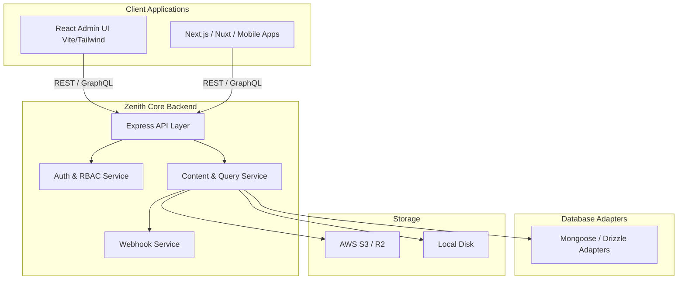

<div align="center">
  
  <h1>Zenith CMS</h1>
  <p><strong>The enterprise-grade, headless CMS built for performance, security, and developer experience.</strong></p>
</div>

---

## 🚀 Overview

Zenith CMS is a powerful, TypeScript-first headless content management system. It provides an intuitive React Admin panel alongside a highly optimized, fully typed Node.js core backend. With native support for MongoDB and PostgreSQL, robust multi-tenant data isolation, and comprehensive API generation, Zenith CMS is designed to scale from simple portfolios to complex enterprise platforms.

## 🏗️ Architecture

Zenith CMS employs a robust, modular monorepo architecture:



## ⚡ Quick Start

Get up and running with Zenith CMS in less than a minute using our interactive CLI:

```bash
npx create-zenith-app@latest my-zenith-project
cd my-zenith-project
npm run dev
```

This will automatically bootstrap your project, configure your `.env` file, and start the development server on `http://localhost:3000`.

## ⚙️ Environment Variables Reference

Zenith CMS requires certain environment variables to be configured. The CLI sets up reasonable defaults, but you can heavily customize your deployment:

| Variable | Type | Required | Safe Default | Description |
|---|---|---|---|---|
| `DATABASE_URL` | string | Yes | `mongodb://localhost:27017/zenith` | The connection string to your MongoDB or PostgreSQL database. |
| `REDIS_URL` | string | No | `redis://localhost:6379` | URL for Redis caching and distributed rate-limiting. |
| `JWT_SECRET` | string | Yes | `super_secret_dev_key` | Secret key used for signing JSON Web Tokens. Must be randomly generated in production. |
| `PORT` | number | No | `3000` | The port the core backend runs on. |
| `NODE_ENV` | string | No | `development` | Setting to `production` enables caching and disables development logging. |
| `S3_BUCKET` | string | No | - | AWS S3 Bucket name for media storage. |
| `S3_REGION` | string | No | - | AWS S3 Region. |
| `S3_ACCESS_KEY` | string | No | - | AWS S3 Access Key ID. |
| `S3_SECRET_KEY` | string | No | - | AWS S3 Secret Access Key. |
| `S3_ENDPOINT` | string | No | - | Custom S3 endpoint (e.g. Cloudflare R2 or MinIO). |
| `WEBHOOK_MAX_RETRIES` | number | No | `4` | Number of times a failed webhook will retry. |

## 📖 Configuration

Your primary configuration lives in `cms.config.ts`. Here you define your schema, collections, auth strategies, and plugins.

```typescript
import { buildConfig } from '@zenith-open/zenithcms-core';

export default buildConfig({
  admin: {
    useAsTitle: 'name'
  },
  collections: [
    {
      slug: 'posts',
      name: 'Posts',
      fields: [
        { name: 'title', type: 'text', required: true },
        { name: 'content', type: 'richtext' }
      ]
    }
  ]
});
```

## 🚢 Deployment

Zenith CMS is container-ready. We provide multi-stage `Dockerfile` templates and Kubernetes manifests.

### Docker Compose
To deploy locally using Docker:
```bash
docker-compose up -d
```

### Kubernetes
For enterprise deployments, see the `/k8s` directory for auto-scaling HPA, rolling update deployments, and Nginx Ingress routes.

## 📊 Monitoring & Observability

Zenith CMS ships with enterprise-grade telemetry out of the box:

- **Prometheus Metrics**: Available at `/metrics`. Ensure your ingress proxy (e.g. Nginx, Traefik) restricts public access to this route.
- **Grafana Dashboard**: Import `docs/monitoring/grafana-dashboard.json` into Grafana for a pre-configured dashboard monitoring core performance and database health.
- **Sentry Error Tracking**: Configure `SENTRY_DSN` in your environment to automatically track unhandled exceptions and performance profiles. OpenTelemetry spans are automatically synced with Sentry.

## 🤝 Contributing

We welcome contributions! Please see our [Contributing Guide](CONTRIBUTING.md) for details on submitting pull requests, setting up the local monorepo (using `pnpm`), and our coding standards.

## 📄 License

Zenith CMS is licensed under the MIT License. See the `LICENSE` file for more details.
