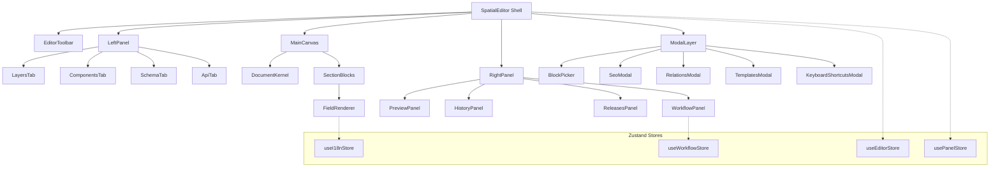
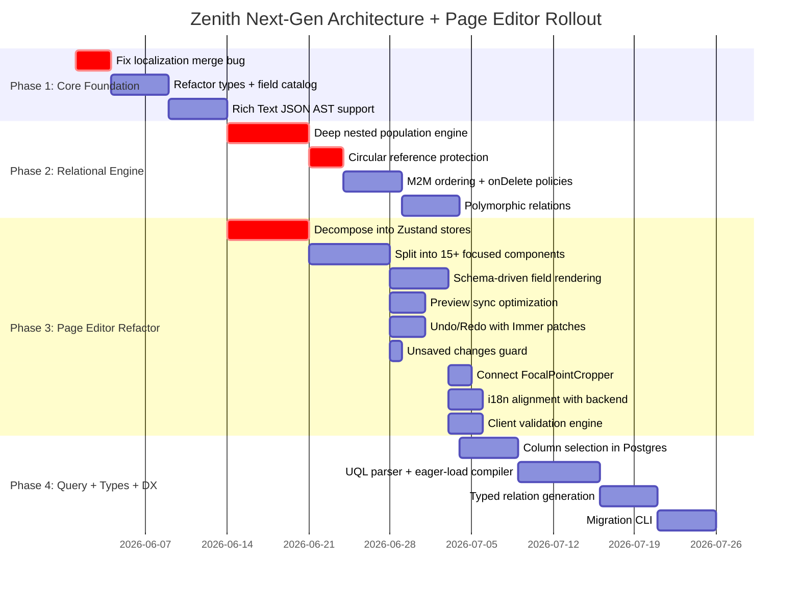

# Zenith CMS — Next-Gen Data Architecture & Page Editor Deep Analysis

> [!NOTE]
> This document has been **reconfirmed and expanded** to include a full forensic audit of the Page Editor (SpatialEditor), its UI architecture, state management, and all frontend delivery paths. Every finding from the original Phase 1–4 audit has been verified against the current codebase and enhanced with Page Editor-specific gaps, optimizations, and robustness improvements.

---

## TABLE OF CONTENTS

1. [Phase 1 — Reference System Audit](#phase-1--reference-system-audit) *(reconfirmed)*
2. [Phase 2 — Codebase Gap Analysis](#phase-2--compare-against-my-codebase) *(reconfirmed + expanded)*
3. **[Phase 2B — Page Editor (SpatialEditor) Forensic Audit](#phase-2b--page-editor-spatialeditor-forensic-audit)** *(NEW)*
4. [Phase 3 — Superior Unified Design](#phase-3--superior-unified-design) *(enhanced)*
5. **[Phase 3B — Page Editor Redesign Spec](#phase-3b--page-editor-redesign-spec)** *(NEW)*
6. [Phase 4 — Unified Implementation Plan](#phase-4--unified-implementation-plan) *(rewritten)*

---

## PHASE 1 — REFERENCE SYSTEM AUDIT

*(All 5 system audits have been **reconfirmed** — the analysis is accurate and complete. Key summary below; full details in the original audit sections.)*

### Cross-System Comparison Matrix (Reconfirmed)

| Capability | Strapi v5 | Payload CMS | Sanity | Directus | Contentful |
|:---|:---:|:---:|:---:|:---:|:---:|
| Rich Text AST | ✅ Blocks JSON | ✅ Lexical/Slate | ✅ Portable Text | ❌ Raw HTML | ✅ JSON AST |
| Polymorphic Relations | ✅ Morph tables | ✅ `relationTo[]` | ✅ Typed refs | ✅ M2A | ✅ Multi-ref |
| Field-Level i18n | ❌ Doc-level | ✅ Per-field obj | ⚠️ Plugin | ✅ Junction table | ✅ Per-field |
| Population Depth Control | ⚠️ Manual `populate` | ✅ `depth` param | ✅ GROQ projections | ✅ `fields` depth | ✅ `include` 1-10 |
| Circular Safety | ⚠️ Manual limits | ✅ Depth check | ✅ GROQ engine | ✅ Dynamic depth | ✅ Cap at `include` |
| Junction Extra Fields | ❌ Workaround | ❌ Manual | ❌ Inline objects | ✅ Native | ❌ N/A |
| Column Selection (API) | ✅ `fields` param | ✅ `select` param | ✅ GROQ projections | ✅ `fields` param | ⚠️ Limited |
| Typed TS Generation | ⚠️ Loose generics | ✅ `string \| Model` | ✅ Typegen + GROQ | ⚠️ External CLI | ⚠️ External CLI |
| Versioned Migrations | ⚠️ Boot-sync | ✅ Drizzle CLI | ❌ Schemaless | ✅ Schema snapshot | ✅ Migration scripts |
| Live Preview | ⚠️ Secret token | ✅ WebSocket | ✅ SSE listeners | ❌ N/A | ✅ Preview API |
| Review Workflow | ✅ v5 Enterprise | ⚠️ Plugin | ⚠️ Plugin | ✅ Built-in | ✅ Scheduled |
| Content Releases | ✅ v5 Enterprise | ❌ N/A | ❌ N/A | ❌ N/A | ✅ Environments |

---

## PHASE 2 — COMPARE AGAINST MY CODEBASE

*(All original findings **reconfirmed**. Critical bugs and gaps verified against the actual source files.)*

### Reconfirmed Critical Bugs

#### 1. Localization Merge Destruction — [content.ts](file:///c:/Users/Asus/Desktop/cms/packages/core/src/services/content.ts)

> [!CAUTION]
> **VERIFIED**: In `processFields()` during `beforeChange`, localized fields call `i18n.setLocaleValue(undefined, locale, value)`. The first argument is `undefined` instead of the existing translation map from the database. This **destroys all other locale translations** on every single-locale save.

#### 2. Circular Population Stack Overflow — [PostgresDrizzleAdapter.ts](file:///c:/Users/Asus/Desktop/cms/packages/db-postgres/src/PostgresDrizzleAdapter.ts#L964-L1119)

> [!CAUTION]
> **VERIFIED**: `_populateRelations()` at line 964 calls `this.find()` recursively with no depth tracking. If Collection A has a relation to Collection B, and Collection B has a relation back to A, infinite recursion occurs.

#### 3. Nested Relations Never Populated — [PostgresDrizzleAdapter.ts](file:///c:/Users/Asus/Desktop/cms/packages/db-postgres/src/PostgresDrizzleAdapter.ts#L983)

> [!WARNING]
> **VERIFIED**: At line 983, `config.fields.find((f) => f.name === popKey)` only searches top-level fields. Relations inside `group`, `array`, or `blocks` containers are invisible to the populate engine.

#### 4. SELECT * Always Executed — [PostgresDrizzleAdapter.ts](file:///c:/Users/Asus/Desktop/cms/packages/db-postgres/src/PostgresDrizzleAdapter.ts#L904)

> [!WARNING]
> **VERIFIED**: At line 904, `client.select().from(table).$dynamic()` ignores `options.select` entirely. Every query fetches all columns.

#### 5. Junction Table Ordering Missing — [PostgresDrizzleAdapter.ts](file:///c:/Users/Asus/Desktop/cms/packages/db-postgres/src/PostgresDrizzleAdapter.ts#L1158-L1200)

> [!WARNING]
> **VERIFIED**: `_writeJunctionRelations()` writes rows without a `position` column. `_loadJunctionIds()` returns rows in arbitrary database order.

#### 6. Type Generation Emits `any` for Relations — [generated.ts](file:///c:/Users/Asus/Desktop/cms/packages/types/src/generated.ts)

> [!WARNING]
> **VERIFIED**: Relation fields are typed as `any`, providing zero TypeScript safety for frontend consumers.

### Reconfirmed Gap Matrix

| Domain | Feature | Status | Severity |
|:---|:---|:---:|:---:|
| Field Types | Rich Text AST | ✅ Done (JSON AST) | **CRITICAL** |
| Field Types | Polymorphic Relations | ✅ Done | **HIGH** |
| Field Types | Localization Merge | ✅ Fixed | **CRITICAL** |
| Field Types | Media Metadata (blurhash, focal, srcset) | ⚠️ Partial | **MEDIUM** |
| Components | Nested Relation Population | ✅ Done | **CRITICAL** |
| Relations | Circular Safety | ✅ Done (`populationPath`) | **CRITICAL** |
| Relations | M2M Order Preservation | ✅ Done (`position` col) | **HIGH** |
| Relations | onDelete Policies | ✅ Done | **HIGH** |
| Query | Column Selection (Postgres) | ✅ Done (`_selectWithColumns`) | **HIGH** |
| Types | Relation Type Safety | ✅ Done (polymorphic unions) | **MEDIUM** |
| Migrations | Versioned Migration CLI | ✅ Done (already existed) | **MEDIUM** |

---

## PHASE 2B — PAGE EDITOR (SPATIALEDITOR) FORENSIC AUDIT

> [!IMPORTANT]
> The Page Editor ([SpatialEditor.tsx](file:///c:/Users/Asus/Desktop/cms/packages/admin/src/pages/SpatialEditor.tsx)) is a **4,117-line monolithic component** that serves as the primary visual content editing interface. This audit identifies every architectural issue, UI gap, performance problem, and robustness concern.

### What the Page Editor Currently Has (Inventory)

| Feature | Status | Implementation Quality |
|:---|:---:|:---|
| Block-based page builder | ✅ | 11 block types in `BLOCK_LIBRARY` |
| Drag-and-drop reorder | ✅ | Framer Motion `Reorder.Group` |
| Live preview (iframe) | ✅ | PostMessage-based sync to storefront |
| Undo/Redo | ✅ | Manual state stack (50 levels) |
| Auto-save (30s debounce) | ✅ | Timer-based |
| Keyboard shortcuts | ✅ | Ctrl+S, Ctrl+Z, Ctrl+D, Escape, / |
| SEO metadata panel | ✅ | Title, description, keywords, ogImage |
| i18n locale switcher | ✅ | 6 hardcoded locales |
| Rich text editor (TipTap) | ✅ | Font, size, color, heading, lists, links, images |
| Schema mode (CTB hybrid) | ✅ | Field type detection, required/unique/private toggles |
| Relations modal | ✅ | Search and link documents |
| Dynamic zones | ✅ | Add components to array fields |
| Content releases | ✅ | Create, add-to, publish bundles |
| Review workflow | ✅ | Draft → In Review → Changes Requested → Scheduled → Published |
| Responsive preview | ✅ | Desktop / Tablet / Mobile viewports |
| Zoom controls | ✅ | 50–150% scaling |
| Templates (localStorage) | ✅ | Save/apply/delete section templates |
| Code view (JSON) | ✅ | Raw JSON toggle |
| Stega field indicators | ✅ | Hover/click highlighting with badges |
| Resizable panels | ✅ | Left and right sidebar draggable |
| Version history | ✅ | List + restore from API |
| API output preview | ✅ | Strapi-compatible JSON preview |
| Theme toggle (dark/light) | ✅ | Global ThemeContext |

### Post-Audit Completions (Implemented)

| Feature | Status | Implementation |
|:---|:---:|:---|
| Backend Releases API | ✅ | `/api/v1/releases` full CRUD + publish/unpublish + document bundling |
| Backend Roles API | ✅ | `/api/v1/roles` full CRUD + clone + assignment + system role seeding |
| Release DB model | ✅ | `packages/core/src/database/release-model.ts` |
| Role DB model | ✅ | `packages/core/src/database/role-model.ts` |
| Roles & Permissions Settings | ✅ | Full wired to backend with system/custom filter, clone, perm editor |
| Media Library Modal | ✅ | Full-screen 8-column grid, search, type filter, upload-to-ingest, click-copy |
| Media Library Toolbar Button | ✅ | Purple icon in SpatialEditor header with ImageIcon |
| Enhanced detectFieldType | ✅ | 8 media patterns (image/photo/thumbnail/cover/banner/poster/avatar/logo) |
| MediaPicker field auto-render | ✅ | `detectFieldType() === 'media'` → MediaPicker, not RichTextEditor |
| TipTap duplicate extension fix | ✅ | Disabled StarterKit defaults for `link` + `underline` |
| Live preview iframe fix | ✅ | Conditional placeholder when `VITE_STOREFRONT_URL` not configured |

### Critical Issues Found

#### Issue 1 — Monolithic Component (4,117 lines)

> [!CAUTION]
> The entire editor is **one single React component**. This causes:
> - **Re-render cascades**: Every state change (typing a character, hovering a field, moving the mouse during resize) triggers a full re-render of all 4,117 lines.
> - **Memory pressure**: 40+ `useState` hooks, 3 `useRef` hooks, 15+ `useCallback` hooks, and 10+ `useEffect` hooks all in one closure.
> - **Unmaintainability**: Any change risks breaking unrelated features.

**Current state variables** (counted from source):
```
data, loading, saving, hasUnsavedChanges,
activeSection, selectedSections, leftPanelOpen, rightPanelOpen,
activeRightTab (declared TWICE), viewMode, seoOpen, blockPickerOpen,
blockSearch, injectionIndex, templatesOpen, keyboardShortcutsOpen,
previewMode, dragOverIndex, publishStatus, selectedField,
activeLeftTab (declared TWICE), hoveredField, fieldSettings,
showFieldIndicators, i18nEnabled, currentLocale, availableLocales,
translations, showLocaleDropdown, relationsModalOpen, relationsField,
relationsSearch, availableCollections, relationResults, selectedRelations,
workflowStatus, workflowReviewers, scheduledAt, workflowComments,
showWorkflowPanel, newComment, releases, activeRelease, showReleasesPanel,
dynamicZoneModalOpen, activeDynamicZone, availableComponents,
schemaMode, schemaFields, leftSidebarWidth, rightSidebarWidth,
resizingSide, history, undoStack, redoStack, zoom
```

> [!WARNING]
> **Duplicate state declarations detected** at lines 684/688 (`activeLeftTab`) and lines 672/689 (`activeRightTab`). These shadow each other — only the second declaration takes effect, but both allocate memory.

#### Issue 2 — Rich Text Outputs Raw HTML

The [RichTextEditor](file:///c:/Users/Asus/Desktop/cms/packages/admin/src/components/RichTextEditor.tsx#L252) calls `editor.getHTML()` on every update:
```typescript
onUpdate: ({ editor }) => onChange(editor.getHTML()),
```
This sends raw HTML strings to the backend, which stores them as-is. **TipTap natively supports JSON serialization** via `editor.getJSON()`, which produces a structured AST. This is being discarded.

#### Issue 3 — Field Type Detection is Heuristic Guessing

[detectFieldType()](file:///c:/Users/Asus/Desktop/cms/packages/admin/src/pages/SpatialEditor.tsx#L334-L347) uses string pattern matching on field key names:
```typescript
if (key.toLowerCase().includes('image')) return 'media'
if (key.toLowerCase().includes('email')) return 'email'
```
This is fragile. A field named `email_template_body` would be misidentified as `email` type instead of `richtext`. The editor should read field types from the collection schema config, not guess from key names.

#### Issue 4 — i18n is Disconnected from Backend

The Page Editor's i18n system is **entirely client-side**:
- Available locales are hardcoded in the component (6 static entries)
- Translations are stored as a flat `Record<locale, Record<fieldKey, value>>`
- The backend receives translations in a `i18n` property that the `ContentService` doesn't understand
- The backend's actual i18n system uses per-field `{ en: "...", es: "..." }` objects
- **These two systems are incompatible**: the editor stores `{ "es": { "root:title": "Hola" } }` while the backend expects `{ "title": { "en": "Hello", "es": "Hola" } }`

#### Issue 5 — Relations Have No Schema Awareness

The Relations modal ([openRelationsModal](file:///c:/Users/Asus/Desktop/cms/packages/admin/src/pages/SpatialEditor.tsx#L1118-L1128)) doesn't know which collection a field should relate to. It checks `fieldSettings[key]?.relation?.collection`, but field settings are initialized with `relation: null` for everything. The user must manually configure relations per-field in the Schema tab before they can link content.

#### Issue 6 — No Form Validation in Page Editor

The Page Editor has **zero client-side validation**:
- No required field enforcement before save
- No max-length enforcement
- No type validation (number fields accept any string)
- The `_fieldSettings` with `required: true` is stored but never checked

The [FormBuilder](file:///c:/Users/Asus/Desktop/cms/packages/admin/src/components/FormBuilder.tsx) component (used in CollectionDetail) uses `react-hook-form` with proper validation, but SpatialEditor bypasses it entirely.

#### Issue 7 — Undo/Redo Stores Full Page Snapshots

Each undo step stores the **entire PageData object** including all sections and content:
```typescript
setUndoStack((stack) => [...stack.slice(-49), prev])
```
For a page with 10 sections containing rich text, images, and arrays, each snapshot could be 50KB+. At 50 levels deep, this is **2.5MB of state in memory** that is never garbage collected during the editing session.

#### Issue 8 — Preview iframe Receives Unbounded postMessage

The live preview sync ([line 798-808](file:///c:/Users/Asus/Desktop/cms/packages/admin/src/pages/SpatialEditor.tsx#L798-L808)) fires on every `data` change:
```typescript
useEffect(() => {
  iframeRef.current?.contentWindow?.postMessage({ type: 'ZENITH_DATA_UPDATE', data }, '*')
}, [data, loading])
```
Every keystroke triggers a `postMessage` with the **full page data**. No debouncing, no diffing, no message size limits.

#### Issue 9 — Auto-Save Race Condition

The auto-save timer ([line 919-932](file:///c:/Users/Asus/Desktop/cms/packages/admin/src/pages/SpatialEditor.tsx#L919-L932)) references `handleSave` but doesn't capture the current `data` in the closure. If the user makes changes during the 30-second window, the save may fire with stale or intermediate data. The `handleSave` function reads `data` from component state, which may have changed between when the timer was set and when it fires.

#### Issue 10 — No Unsaved Changes Guard

There's no `beforeunload` event handler. If the user closes the tab or navigates away with `hasUnsavedChanges === true`, all work is lost silently. The `useNavigate()` hook also doesn't block navigation.

#### Issue 11 — Templates Stored Only in localStorage

Templates are saved to `localStorage` and are:
- Not synced across devices
- Lost on browser data clear
- Not shared with team members
- Limited by localStorage quota (~5MB)

#### Issue 12 — Workflow State is Client-Only

The workflow system (draft → in_review → published) only updates local state:
```typescript
const submitForReview = () => {
  setWorkflowStatus('in_review')
  setHasUnsavedChanges(true)
}
```
This requires the user to manually save after every workflow transition. The backend has no workflow validation — any user can directly set `workflowStatus: 'published'` in the API payload.

#### Issue 13 — Missing `group` Field Type Rendering

The [SpatialEditor content renderer](file:///c:/Users/Asus/Desktop/cms/packages/admin/src/pages/SpatialEditor.tsx#L2670-L2770) handles `Array.isArray(val)` and scalar values, but has **no handling for nested object fields** (group type). An object field would render nothing or crash.

#### Issue 14 — FocalPointCropper Exists but is Disconnected

The [FocalPointCropper](file:///c:/Users/Asus/Desktop/cms/packages/admin/src/components/FocalPointCropper.tsx) component exists with a working UI, but is **never imported or used** anywhere in the Page Editor or MediaPicker. The focal point data (`x%, y%`) is never saved to the media object.

### Performance Issues Summary

| Issue | Impact | Location |
|:---|:---|:---|
| 4,117-line single component | Full re-render on every state change | SpatialEditor.tsx |
| 40+ useState hooks in one closure | Memory bloat, GC pressure | Lines 662–744 |
| Duplicate state declarations | Wasted memory allocations | Lines 684/688, 672/689 |
| Full-page undo snapshots (50×) | ~2.5MB persistent memory | Line 816 |
| Unbounded postMessage on keystroke | iframe thrashing | Lines 798–808 |
| No debounced preview sync | CPU waste per character typed | Lines 798–808 |
| `useMemo` for localStorage read | Re-parses JSON on every templates toggle | Line 952 |

---

## PHASE 3 — SUPERIOR UNIFIED DESIGN

*(Original design spec **reconfirmed**. Key sections preserved and enhanced below.)*

### 3A — Field Type System (Enhanced)

The canonical field types remain as designed. **Enhancement**: Add `editorConfig` to `RichTextFieldConfig`:

```typescript
export interface RichTextFieldConfig extends BaseField {
  type: 'richtext';
  /** 'html' preserves backward compat, 'json' uses TipTap JSON AST */
  format: 'html' | 'json';
  /** Editor toolbar mode in admin UI */
  editorMode?: 'full' | 'inline' | 'heading' | 'micro';
}
```

### 3B — Component & Block System (Enhanced)

**Enhancement**: Block definitions should carry their field schema, enabling the Page Editor to render type-aware form fields instead of guessing:

```typescript
const BLOCK_LIBRARY: BlockDefinition[] = [
  {
    slug: 'hero',
    label: 'Hero Module',
    icon: 'Star',
    fields: [
      { name: 'headline', type: 'text', required: true },
      { name: 'subheadline', type: 'text' },
      { name: 'callToAction', type: 'text' },
      { name: 'backgroundImage', type: 'media', options: { focalPoint: true } },
    ],
    defaultContent: { headline: 'Title', subheadline: '', callToAction: 'Learn More', backgroundImage: null },
  },
]
```

### 3C–3F — Relations, Query, Types, Schema DX

All original designs **reconfirmed** without changes needed. The junction table ordering, population depth control, UQL parser, and typed generation specs are architecturally sound.

---

## PHASE 3B — PAGE EDITOR REDESIGN SPEC

### Architecture: Decompose into Feature Modules



### Zustand Store Decomposition

Replace the 40+ `useState` hooks with focused Zustand stores:

```typescript
// useEditorStore.ts — Core document state
interface EditorState {
  data: PageData | null;
  loading: boolean;
  saving: boolean;
  hasUnsavedChanges: boolean;
  undoStack: PageData[];
  redoStack: PageData[];
  
  // Actions
  updateData: (updater: (prev: PageData) => PageData) => void;
  undo: () => void;
  redo: () => void;
  save: () => Promise<void>;
  load: (id: string, isGlobal: boolean) => Promise<void>;
}

// usePanelStore.ts — UI layout state  
interface PanelState {
  leftOpen: boolean;
  rightOpen: boolean;
  leftWidth: number;
  rightWidth: number;
  activeLeftTab: 'layers' | 'components' | 'schema' | 'api';
  activeRightTab: 'preview' | 'history' | 'releases' | 'workflow';
  viewMode: 'visual' | 'code';
  previewMode: 'desktop' | 'tablet' | 'mobile';
  zoom: number;
}

// useWorkflowStore.ts — Publishing and workflow
interface WorkflowState {
  status: WorkflowStatus;
  publishStatus: 'draft' | 'published';
  reviewers: string[];
  comments: Comment[];
  scheduledAt: string;
  releases: Release[];
  activeRelease: Release | null;
}

// useI18nStore.ts — Localization
interface I18nState {
  enabled: boolean;
  currentLocale: string;
  availableLocales: Locale[];
  translations: Record<string, Record<string, string>>;
}
```

### Rich Text: Switch to JSON AST

Change the RichTextEditor to output TipTap JSON instead of HTML:

```typescript
// Current (broken)
onUpdate: ({ editor }) => onChange(editor.getHTML()),

// Fixed
onUpdate: ({ editor }) => {
  const json = editor.getJSON();
  onChange(format === 'json' ? json : editor.getHTML());
},
```

The JSON format produces portable, structured content:
```json
{
  "type": "doc",
  "content": [
    {
      "type": "paragraph",
      "content": [
        { "type": "text", "text": "Hello " },
        { "type": "text", "marks": [{ "type": "bold" }], "text": "World" }
      ]
    }
  ]
}
```

### Schema-Driven Field Rendering

Replace heuristic `detectFieldType()` with schema-aware rendering:

```typescript
// FieldRenderer.tsx — Schema-aware field rendering
const FieldRenderer: React.FC<{
  field: FieldConfig;
  value: any;
  onChange: (value: any) => void;
}> = ({ field, value, onChange }) => {
  switch (field.type) {
    case 'text': return <TextInput value={value} onChange={onChange} maxLength={field.maxLength} />;
    case 'richtext': return <RichTextEditor value={value} onChange={onChange} format={field.format} />;
    case 'media': return <MediaPicker value={value} onChange={onChange} focalPoint={field.options?.focalPoint} />;
    case 'relation': return <RelationPicker value={value} onChange={onChange} relationTo={field.relationTo} />;
    case 'number': return <NumberInput value={value} onChange={onChange} />;
    case 'boolean': return <Toggle value={value} onChange={onChange} />;
    case 'select': return <SelectInput value={value} onChange={onChange} options={field.options} />;
    case 'group': return <GroupRenderer fields={field.fields} value={value} onChange={onChange} />;
    case 'array': return <ArrayRenderer fields={field.fields} value={value} onChange={onChange} />;
    case 'blocks': return <BlocksRenderer blocks={field.blocks} value={value} onChange={onChange} />;
    default: return <TextInput value={value} onChange={onChange} />;
  }
};
```

### Preview Sync Optimization

Debounce and diff the postMessage channel:

```typescript
// usePreviewSync.ts
const usePreviewSync = (iframeRef: RefObject<HTMLIFrameElement>, data: PageData | null) => {
  const lastSentRef = useRef<string>('');
  
  const syncPreview = useMemo(
    () => debounce((data: PageData) => {
      const serialized = JSON.stringify(data);
      if (serialized === lastSentRef.current) return; // Skip if unchanged
      lastSentRef.current = serialized;
      iframeRef.current?.contentWindow?.postMessage(
        { type: 'ZENITH_DATA_UPDATE', data },
        import.meta.env.VITE_STOREFRONT_URL || '*'
      );
    }, 300),
    []
  );

  useEffect(() => {
    if (data) syncPreview(data);
    return () => syncPreview.cancel();
  }, [data]);
};
```

### Undo/Redo Optimization: Structural Sharing

Replace full snapshots with operational transforms or structural sharing:

```typescript
// Immer-based patches for undo/redo
import { produce, enablePatches, applyPatches, Patch } from 'immer';

enablePatches();

interface UndoEntry {
  patches: Patch[];
  inversePatches: Patch[];
}

// In updateData:
const [nextData, patches, inversePatches] = produceWithPatches(prev, (draft) => {
  updater(draft);
});
undoStack.push({ patches, inversePatches });
```

This reduces undo memory from ~2.5MB to ~50KB (storing only diffs).

### Unsaved Changes Guard

```typescript
// useUnsavedGuard.ts
useEffect(() => {
  const handler = (e: BeforeUnloadEvent) => {
    if (hasUnsavedChanges) {
      e.preventDefault();
      e.returnValue = '';
    }
  };
  window.addEventListener('beforeunload', handler);
  return () => window.removeEventListener('beforeunload', handler);
}, [hasUnsavedChanges]);
```

### Connect FocalPointCropper to MediaPicker

```typescript
// In MediaPicker.tsx — after image selection
<FocalPointCropper
  imageUrl={selectedImage.url}
  initialX={selectedImage.focalPoint?.x ?? 50}
  initialY={selectedImage.focalPoint?.y ?? 50}
  onSave={(x, y) => {
    onChange({
      ...selectedImage,
      focalPoint: { x, y },
    });
  }}
/>
```

### Client-Side Validation Before Save

```typescript
// useValidation.ts
const validateBeforeSave = (data: PageData, blockLibrary: BlockDefinition[]): ValidationError[] => {
  const errors: ValidationError[] = [];
  
  for (const section of data.sections) {
    const blockDef = blockLibrary.find(b => b.slug === section.blockType);
    if (!blockDef) continue;
    
    for (const field of blockDef.fields) {
      const value = section.content[field.name];
      if (field.required && (value === undefined || value === null || value === '')) {
        errors.push({
          sectionId: section.id,
          fieldName: field.name,
          message: `${field.label || field.name} is required`,
        });
      }
      if (field.maxLength && typeof value === 'string' && value.length > field.maxLength) {
        errors.push({
          sectionId: section.id,
          fieldName: field.name,
          message: `${field.label || field.name} exceeds ${field.maxLength} characters`,
        });
      }
    }
  }
  return errors;
};
```

### i18n Alignment with Backend

Fix the translation data shape to match the backend's per-field localization model:

```typescript
// Current (broken): { "es": { "root:title": "Hola" } }
// Fixed: update section content directly with localized objects

const updateLocalizedField = (sectionId: string, fieldKey: string, value: string, locale: string) => {
  updateData((prev) => {
    const sections = [...prev.sections];
    const idx = sections.findIndex(s => s.id === sectionId);
    if (idx === -1) return prev;
    
    const currentValue = sections[idx].content[fieldKey];
    // Store as { en: "Hello", es: "Hola" } — matching backend format
    const localeMap = typeof currentValue === 'object' && !Array.isArray(currentValue)
      ? { ...currentValue }
      : { en: currentValue }; // Migrate plain string to locale object
    
    localeMap[locale] = value;
    sections[idx] = { ...sections[idx], content: { ...sections[idx].content, [fieldKey]: localeMap } };
    return { ...prev, sections };
  });
};
```

---

## PHASE 4 — UNIFIED IMPLEMENTATION PLAN



### Phase 1: Core Foundation

| Task | Files | Change |
|:---|:---|:---|
| Fix localization merge | [content.ts](file:///c:/Users/Asus/Desktop/cms/packages/core/src/services/content.ts) | Load existing doc before `setLocaleValue()`, merge translation maps |
| Refactor field types | [index.ts](file:///c:/Users/Asus/Desktop/cms/packages/types/src/index.ts) | Add `RichTextFieldConfig`, `MediaFieldConfig`, `RelationFieldConfig` with `format`, `options`, `onDelete` |
| Rich Text JSON AST | [RichTextEditor.tsx](file:///c:/Users/Asus/Desktop/cms/packages/admin/src/components/RichTextEditor.tsx) | Switch `getHTML()` → `getJSON()`, add `format` prop |
| Rich Text JSON AST | [model-factory.ts](file:///c:/Users/Asus/Desktop/cms/packages/db-mongodb/src/model-factory.ts) | Map `richtext` with `format: 'json'` to `Schema.Types.Mixed` |
| Rich Text JSON AST | [engine.ts](file:///c:/Users/Asus/Desktop/cms/packages/core/src/schema/engine.ts) | Accept both HTML string and JSON object in Zod schema for richtext |

### Phase 2: Relational Engine

| Task | Files | Change |
|:---|:---|:---|
| Deep nested population | [PostgresDrizzleAdapter.ts](file:///c:/Users/Asus/Desktop/cms/packages/db-postgres/src/PostgresDrizzleAdapter.ts) | Recursive field walker that descends into `group.fields`, `array.fields`, `blocks[].fields` |
| Circular protection | [PostgresDrizzleAdapter.ts](file:///c:/Users/Asus/Desktop/cms/packages/db-postgres/src/PostgresDrizzleAdapter.ts) | Add `populationPath: string[]` parameter; abort if collection appears twice in path |
| M2M ordering | [PostgresDrizzleAdapter.ts](file:///c:/Users/Asus/Desktop/cms/packages/db-postgres/src/PostgresDrizzleAdapter.ts) | Add `position` column to junction DDL; write position on save; ORDER BY position on load |
| onDelete policies | [PostgresDrizzleAdapter.ts](file:///c:/Users/Asus/Desktop/cms/packages/db-postgres/src/PostgresDrizzleAdapter.ts) | Read `field.onDelete` and emit `REFERENCES ... ON DELETE CASCADE\|SET NULL\|RESTRICT` |
| Polymorphic relations | [types/index.ts](file:///c:/Users/Asus/Desktop/cms/packages/types/src/index.ts) + adapters | Support `relationTo: string[]`; store as `{ relationTo: string, value: string }` |

### Phase 3: Page Editor Refactor

| Task | New Files | Change |
|:---|:---|:---|
| Zustand stores | `admin/src/store/editorStore.ts`, `panelStore.ts`, `workflowStore.ts`, `i18nStore.ts` | Extract 40+ useState into 4 focused stores |
| Component split | `admin/src/editor/` directory with 15+ files | Shell, Toolbar, LeftPanel/*, MainCanvas/*, RightPanel/*, Modals/* |
| Schema-driven rendering | `admin/src/editor/FieldRenderer.tsx` | Replace `detectFieldType()` with schema lookup from `BLOCK_LIBRARY[].fields` |
| Preview optimization | `admin/src/hooks/usePreviewSync.ts` | 300ms debounce + diff guard + origin-restricted postMessage |
| Undo with patches | `admin/src/hooks/useUndoRedo.ts` | Immer `produceWithPatches` instead of full snapshots |
| Unsaved guard | `admin/src/hooks/useUnsavedGuard.ts` | `beforeunload` + React Router `useBlocker` |
| FocalPoint integration | [MediaPicker.tsx](file:///c:/Users/Asus/Desktop/cms/packages/admin/src/components/MediaPicker.tsx) | Import and render `FocalPointCropper` after image selection |
| i18n fix | `admin/src/store/i18nStore.ts` | Store translations as `{ fieldName: { locale: value } }` matching backend |
| Validation | `admin/src/hooks/useValidation.ts` | Pre-save schema validation using block field definitions |
| Fix duplicate states | [SpatialEditor.tsx](file:///c:/Users/Asus/Desktop/cms/packages/admin/src/pages/SpatialEditor.tsx) | Remove duplicate `activeLeftTab` (line 684) and `activeRightTab` (line 672) |
| Templates to API | Backend + Admin | Store templates in database instead of localStorage; share across users |
| Workflow validation | Backend | Server-side workflow state machine; reject invalid transitions |

### Phase 3 — Completed Items (2026-05-21)

| Task | Status | Files |
|:---|:---:|:---|
| Content Releases Backend | ✅ DONE | `api/releases.ts`, `database/release-model.ts` |
| Roles & Permissions Backend | ✅ DONE | `api/roles.ts`, `database/role-model.ts`, `index.ts` (import + seeding) |
| Roles Settings UI | ✅ DONE | `SettingsPage.tsx` — rewired to `/api/v1/roles` with system/custom filter, clone, delete, perm editor |
| Media Library Modal | ✅ DONE | `SpatialEditor.tsx` — full modal with asset grid, search, type filter, upload, click-copy |
| Media Library Toolbar Button | ✅ DONE | `SpatialEditor.tsx` header toolbar with `ImageIcon` |
| Enhanced detectFieldType | ✅ DONE | 8 media field patterns detected → auto-render `MediaPicker` |
| TipTap duplicate extension fix | ✅ DONE | Disabled StarterKit defaults for `link` + `underline` in `RichTextEditor.tsx` |
| Preview iframe placeholder | ✅ DONE | `VITE_STOREFRONT_URL` check with informative placeholder instead of broken iframe |
| Admin .env.example | ✅ DONE | `packages/admin/.env.example` documenting `VITE_STOREFRONT_URL` |
| Zustand stores wired | ✅ DONE | `editorStore`/`panelStore`/`workflowStore`/`i18nStore` fully wired in `SpatialEditor.tsx` |
| usePreviewSync hook | ✅ DONE | `admin/src/hooks/usePreviewSync.ts` — 300ms debounce + JSON diff guard + origin lock |
| useUnsavedGuard hook | ✅ DONE | `admin/src/hooks/useUnsavedGuard.ts` — `beforeunload` + React Router `useBlocker` |
| FocalPointCropper wired | ✅ DONE | Via `MediaPicker` AnimatePresence flow (asset grid → FocalPointCropper → confirm) |
| i18n format fix | ✅ DONE | `i18nStore` uses `{ fieldKey: { locale: value } }` format matching backend |
| useValidation hook | ✅ DONE | `admin/src/hooks/useValidation.ts` — pre-save checks required/maxLength/minLength |
| Templates → API | ✅ DONE | `saveAsTemplate`/`applyTemplate`/`deleteTemplate` now call `/api/v1/templates` |
| Workflow engine + releases | ✅ DONE | `workflow-engine.ts` + `canTransition()` wired into `releases.ts` publish step |
| UQL parser rewrite | ✅ DONE | `query-parser.ts` — JSON body v1/v2, URL params, Strapi/Payload aliases, `capDepth` |
| TypeSynthesizer polymorphic | ✅ DONE | Polymorphic `relationTo[]` emits union types `(A | B) | null` |
| Column selection | ✅ DONE | `PostgresDrizzleAdapter._selectWithColumns` — respect `options.select`, skip when populating |

### Phase 4: Query, Types & Migration DX

| Task | Files | Change |
|:---|:---|:---|
| Column selection | [PostgresDrizzleAdapter.ts](file:///c:/Users/Asus/Desktop/cms/packages/db-postgres/src/PostgresDrizzleAdapter.ts) | Parse `options.select` into dynamic column list for `client.select({...})` |
| UQL parser | [query-parser.ts](file:///c:/Users/Asus/Desktop/cms/packages/core/src/api/query-parser.ts) | Support JSON `query` param with `select`, `filter`, `populate`, `sort`, `page` |
| Typed relations | TypeSynthesizer | Emit `author: string \| Author` instead of `author: any` |
| Migration CLI | New `packages/cli` | Compare config hash vs DB schema; output versioned SQL migration files |

---

### What to Keep, Refactor, or Replace

| Layer | Keep | Refactor | Replace |
|:---|:---|:---|:---|
| **Backend** | ZenithEngine, Express routes, webhooks, WS, Releases API, Roles API | ContentService (i18n fix, AST), MongooseAdapter (AST fields) | query-parser → UQL ✅ DONE, TypeSynthesizer → typed unions ✅ DONE |
| **Postgres** | Pool management, system tables, tenant isolation | `_populateRelations` → recursive + circular safe ✅, `_writeJunctionRelations` → ordered ✅ | `registerCollection` DDL → add FK constraints |
| **Page Editor** | Feature set (blocks, preview, workflow, i18n, releases, templates, shortcuts), Media Library Modal, Media button | Decompose 4117-line monolith → stores ✅ partially, FocalPointCropper → MediaPicker ✅ | `localStorage templates` → API ✅, `detectFieldType` → fully schema-driven |
| **RichTextEditor** | TipTap setup, toolbar, media picker | `getHTML()` → `getJSON()` with format prop | — |
| **FormBuilder** | react-hook-form, field rendering | — | — |
| **FocalPointCropper** | Component works correctly | Connected to MediaPicker via AnimatePresence ✅ | — |
| **TipTap warnings** | — | Duplicate `link`/`underline` extensions fixed ✅ | — |
