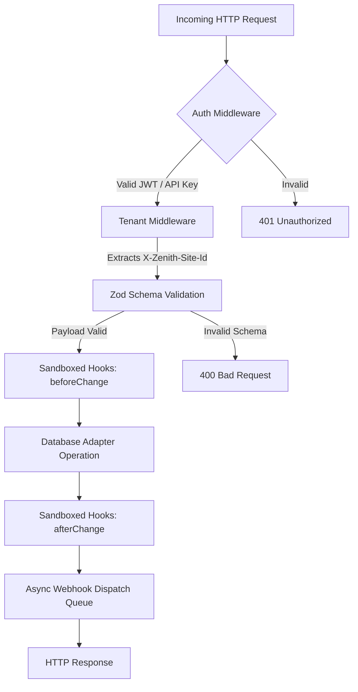
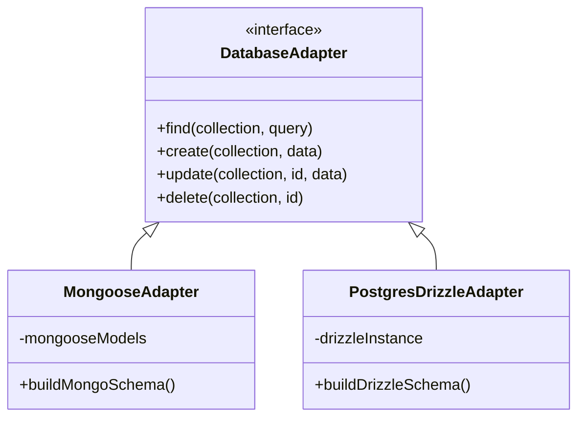

# Zenith CMS — Core Architecture

Zenith is engineered as a multi-tenant headless CMS using a Node.js/TypeScript monorepo architecture. It is designed to be highly decoupled, allowing the database layer, API surface, and administrative UI to evolve independently.

This document details the request lifecycle, the bridging of the database adapters, and the mechanics of tenant isolation.

---

## 1. Monorepo Package Structure

Zenith uses `pnpm` workspaces to manage discrete packages.

```
c:/Users/Asus/Desktop/cms/
├── packages/
│   ├── core/         # Backend API (Express, Database Adapters, Hooks, Webhooks)
│   ├── admin/        # Headless Admin UI (React 19, Vite, Zustand, Tailwind)
│   ├── blog-demo/    # Example Frontend Consumer (Vite/React)
│   └── types/        # Unified Types & Field Config Schemas
└── cms.config.ts     # Global Configuration & Schema Definitions
```

### The Separation of Concerns
- **`@zenith-open/zenithcms-types`**: The source of truth for all schemas. Both the admin UI and the core API rely on these types to ensure compile-time safety.
- **`@zenith-open/zenithcms-core`**: Strictly headless. It handles HTTP requests, authentication, database persistence, and lifecycle hooks. It has zero knowledge of React or UI components.
- **`@zenith-open/zenithcms-admin`**: A single-page application (SPA) that communicates exclusively via the REST API. It handles state management via Zustand and styling via Tailwind CSS.

---

## 2. Request Lifecycle & Pipeline

Every incoming HTTP request to the Zenith core API is processed through a strict middleware pipeline.



### Key Pipeline Stages
1. **Authentication**: Requests are checked for either an HttpOnly session cookie (from the Admin UI) or a Bearer token / API Key (from headless consumers).
2. **Tenant Scoping**: The `X-Zenith-Site-Id` header is extracted and appended to the Request object. All subsequent database operations strictly enforce this ID as a filter.
3. **Zod Validation**: Zod schemas are compiled dynamically from your `cms.config.ts`. Payloads are strictly validated, dropping unexpected fields and enforcing types before hitting the database.
4. **Hooks Execution**: `beforeChange`, `beforeValidate`, and `afterChange` hooks execute. These run in the main event loop but are highly optimized to prevent blocking.

---

## 3. Database Adapter Bridge

Zenith is unique in its support for both document (MongoDB) and relational (PostgreSQL) databases without requiring a rewrite of your data access logic.

This is achieved via the `DatabaseAdapter` abstract interface.



### How It Works
- The Core API **never** imports `mongoose` or `drizzle` directly in its route handlers.
- Instead, route handlers call methods on the generic `adapter` instance.
- **PostgreSQL / Drizzle**: When PostgreSQL is selected, Zenith maps complex field types (like `blocks`, `dz`, and `array`) into JSONB columns, while maintaining foreign keys for `relation` fields via automated junction tables.
- **MongoDB / Mongoose**: When MongoDB is selected, Zenith utilizes BSON schema validation and nested sub-documents.

---

## 4. Multi-Tenant Data Isolation

Multi-tenancy in Zenith means one deployment can serve multiple completely isolated "Sites" (tenants).

### The Mechanics of Isolation
1. **The Header**: Every API request that mutates or retrieves data must provide the `X-Zenith-Site-Id` header.
2. **The Enforcement**: In the Database Adapter layer, every query is transparently intercepted. If the requested operation targets a collection, the adapter automatically injects `{ siteId: request.siteId }` into the database query.
3. **The Result**: It is cryptographically and logically impossible for Site A to query or mutate Site B's data, as the database adapter enforces the filter at the lowest level before the query executes.

### Globals vs Collections
- **Collections** are scoped to the `siteId`.
- **Globals** are singletons, but they are *also* scoped to the `siteId` (e.g., each Site has its own "Site Settings" global document).

---

## 5. Media Delivery & CDN Recommendations

Zenith utilizes an on-the-fly image processing engine via `sharp` for resizing and format conversions.

> [!WARNING]
> **Blast Radius**: High CPU usage if Zenith is exposed to public traffic without a CDN.
> **Remediation**: Ensure documentation strictly recommends placing Zenith behind a CDN (Cloudflare, Fastly) for image delivery.

To mitigate this, Zenith implements an internal disk cache in `media/.cache/` for generated transformations. However, for public production traffic, you **must** configure a CDN to cache media requests at the edge.

---

## 6. Real-Time Collaboration (WebSockets)

Unlike legacy headless CMS platforms, Zenith features a robust, deeply integrated Real-Time WebSocket engine. 

> [!TIP]
> **Real-Time by Default**: Zenith's websocket layer pushes instant database updates, presence awareness, and collaborative editing states to the Admin UI in milliseconds. This real-time architecture is a significant competitive advantage and enables Google Docs-style collaboration natively out of the box.

---

## 7. Next Steps

- For an overview of API consumption, refer to the [REST API Manual](./MANUAL.md#part-6--the-rest-api).
- For details on setting up local instances, refer to the [Getting Started Manual](./MANUAL.md#part-1--getting-started).
