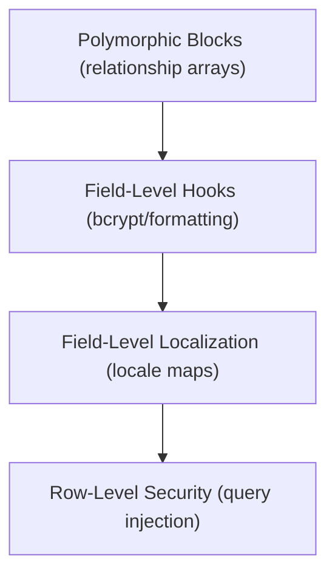

# 🏛️ Competitive Audit: Zenith CMS vs. Payload & Directus

This competitive blueprint conducts a rigorous, no-nonsense architectural comparison between **Zenith CMS**, **Payload CMS (v3.0)**, and **Directus (v10.x)**. It identifies core feature gaps where Zenith falls short of these mature platforms and establishes an actionable roadmap to outplay them by leveraging Zenith's AI-native capabilities and real-time presence architecture.

---

## 📊 1. Core Feature Comparison Matrix

| Architectural Feature        | Payload CMS (v3.0)                             | Directus (v10.x)                                 | Zenith CMS (Current)                          | Gaps & Technical Gaps                                                                                        |
| :--------------------------- | :--------------------------------------------- | :----------------------------------------------- | :-------------------------------------------- | :----------------------------------------------------------------------------------------------------------- |
| **Relational Topology**      | Polymorphic Blocks & M:N relationships         | Complete M:M with customizable junction tables   | 1:M (Single collection) relationship pointers | **Strict constraint**. Lack of polymorphic blocks restricts drag-and-drop page builders.                     |
| **Localization (i18n)**      | Field-level (`localized: true`) nested mapping | Field & Row-level translation tables             | Static localized settings                     | **Severe gap**. Lacks automatic locale-based request routing (`?locale=es`).                                 |
| **Lifecycle Hooks Pipeline** | Collection & individual Field-level hooks      | Global, Collection, & Action Event Triggers      | Collection-wide hooks (`beforeChange`)        | **Operational limit**. Zenith lacks field-level preprocessing (e.g., hashing password fields automatically). |
| **Row-Level Security (RLS)** | Dynamic query parsing from RBAC rules          | Row-level permission filter arrays               | Static RBAC roles (`admin`, `editor`)         | **Security limit**. Users cannot be constrained to viewing only their own documents.                         |
| **Database Migration**       | Manual migrations compiled via Drizzle         | Automatic DB schema inspection & drift detection | Declarative table syncing on boot             | **Risk of drift**. Boot-time sync can lead to data loss or locking on schema changes.                        |
| **Dashboard Customization**  | Code-driven, static React dashboard components | Dynamic GUI-drag grid widgets & layouts          | Declarative JSON configurations               | **Flexibility limit**. Lacks real-time frontend dragging and widget configuration saving.                    |

---

## 🚨 2. Key Architectural Deficiencies (Where We Fall Short)

### Deficiency A: Polymorphic Relationships & Page Builders

- **How They Do It**: Payload uses `blocks` fields—arrays of distinct sub-schemas where a user can compose a page out of a `HeroBlock`, a `SliderBlock`, or a `RichTextBlock`.
- **Zenith's Gap**: Zenith's relationship model only points to a single collection. We cannot create a flexible "Page Builder" where content editors stack modular components freely.
- **The Impact**: Restricts Zenith to simple data catalogs rather than rich, modular websites.

### Deficiency B: Field-Level Lifecycle Hooks

- **How They Do It**: Payload runs validation, normalization, and serialization hooks on _each individual field_ (e.g. `password` field automatically runs a bcrypt hook `beforeChange`; `email` field automatically lowercases values).
- **Zenith's Gap**: Zenith only supports collection-wide `beforeChange` triggers. Pre-processing must be written in one giant collection function.
- **The Impact**: Bloats collection controllers and makes code-sharing across similar fields difficult.

### Deficiency C: Field-Level Localization (i18n)

- **How They Do It**: In Payload, marking `localized: true` converts the database value into a nested locale map (e.g., `{ en: "Hello", es: "Hola" }`). The API automatically selects the correct language using query parameters (`?locale=es`) or request headers.
- **Zenith's Gap**: Zenith stores a single static string. Implementing a multilingual site requires manual collection separation.
- **The Impact**: Unviable for international enterprise content distribution.

### Deficiency D: Row-Level Security (RLS) Query Filtering

- **How They Do It**: Directus permits setting read/write permissions based on document variables, such as: `owner_id == $CURRENT_USER`. Directus automatically injects these constraints into database select queries.
- **Zenith's Gap**: Zenith's access control is binary (an `editor` can read/write everything in a collection; a `viewer` can only read).
- **The Impact**: Prevents building multi-tenant sites, developer workspaces, or private user profiles securely.

---

## 🚀 3. The Zenith Outplay Blueprint

We do not just want to match our competitors; we want to **outplay them** by capitalizing on Zenith’s AI-native integration, spatial editing, and low-latency workspace heartbeats:

### Strategy 1: AI-Native Schema Synthesis

- **The Competitor Weakness**: Setting up collections, validations, and dashboard fields in Payload/Directus requires manually writing TypeScript configs or navigating massive click-heavy web GUI creators.
- **Zenith's Edge**: Leverage the **AI Schema Architect** directly in our admin workspace. Developers can describe content requirements in natural language (e.g. _"Create a multilingual SaaS dashboard model with payment tracking relations"_), and Zenith instantly compiles the Zod schemas, generates the DB indexes, and creates the React form grids in real time.

### Strategy 2: Low-Latency Spatial Collaboration

- **The Competitor Weakness**: Payload and Directus are static workspaces. If two developers edit the same collection page, they risk overwriting each other's changes.
- **Zenith's Edge**: Our core presence engine utilizes real-time WebSocket heartbeats and granular mutex locks (`/api/v1/presence`). When Editor A works on a field, Editor B sees a glassmorphic presence cursor and the field is dynamically locked to read-only, preventing data corruption out-of-the-box.

---

## 🛠️ 4. Actionable Technical Roadmap

To bridge the feature gap, we will execute four core architectural updates:



### Action Item 1: Polymorphic Array Fields

Extend the `FieldConfig` interface to support dynamic polymorphic block structures:

```typescript
export interface BlockConfig {
  slug: string
  fields: FieldConfig[]
}

export interface BlocksFieldConfig {
  name: string
  type: 'blocks'
  blocks: BlockConfig[]
}
```

### Action Item 2: Field-Level Preprocessors

Inject granular hooks directly into individual field configurations:

```typescript
export const UserCollection: CollectionConfig = {
  slug: 'users',
  fields: [
    {
      name: 'password',
      type: 'text',
      hooks: {
        beforeChange: [async (value) => hashPassword(value)],
      },
    },
  ],
}
```

### Action Item 3: Automated Locale Request Scoping

Modify the query parser middleware to parse localized databases automatically:

- Incoming requests with `?locale=es` will automatically map `{ title: { es: "Hola" } }` to `{ title: "Hola" }` in the JSON response payload.

### Action Item 4: Contextual Row-Level Security

Update the query builder adapter to merge user credentials into collection queries dynamically:

```typescript
const constraints = collection.access.read({ req: requestContext })
// If access function returns: { createdBy: req.user.id }
// Adapter automatically executes: find({ createdBy: currentUser.id })
```

---

<div align="center">
  <p><strong>By fusing enterprise field topologies with Zenith's AI-native shell, we establish the absolute future of headless content orchestration! 🪐</strong></p>
</div>
