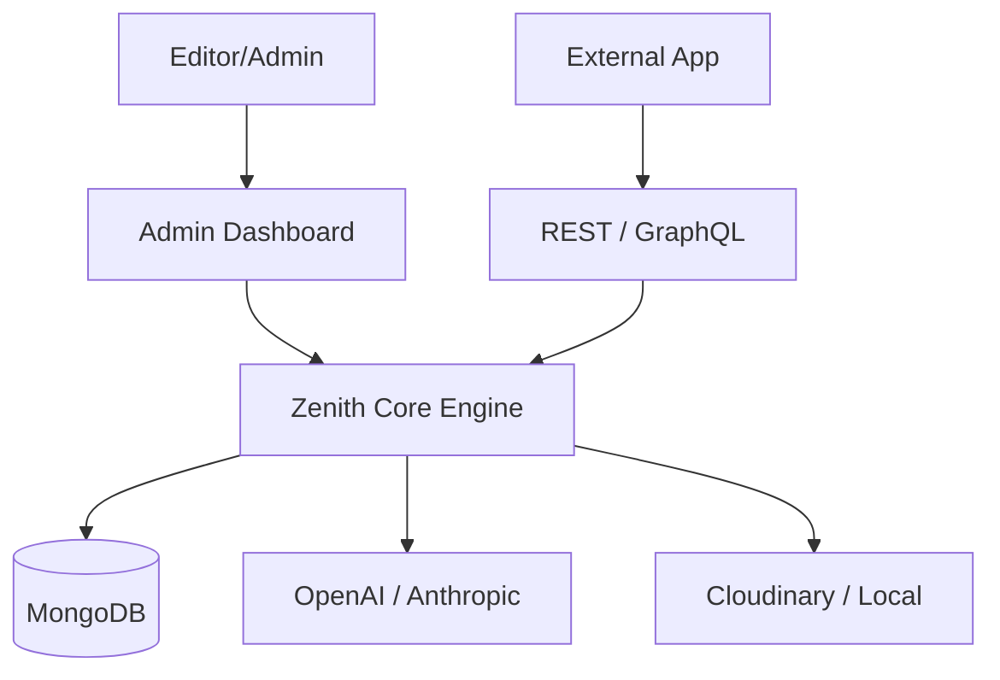

# Zenith CMS Documentation

## Overview
Zenith is a next-generation headless CMS built for speed and security.

## Architecture Diagram

## Features
- **Declarative Schema**: Define everything in one TypeScript file.
- **Auto-Docs**: Instant Swagger and GraphQL.
- **Deep Security**: RLS and Delta Auditing.
